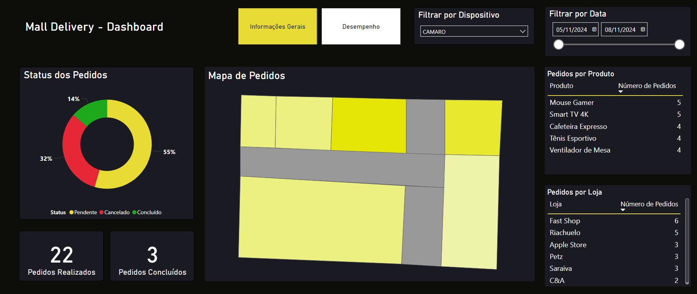
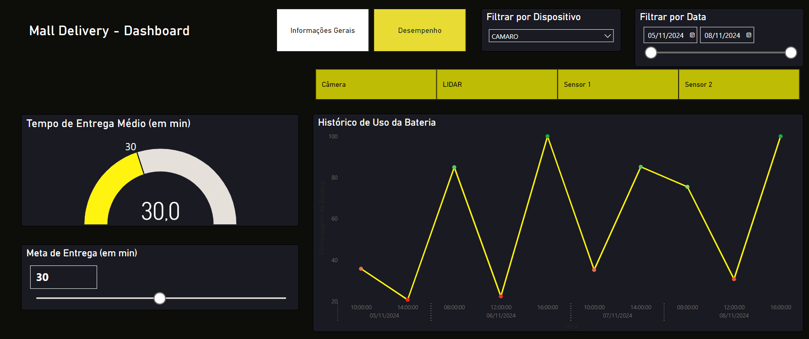

# Mall Delivery -  Dashboard

Dashboard para visualização dos dados do site Mall Delivery.

# Recursos

- Microsoft Power BI 
- Visualização por Dispositivo
- Mapa de Pedidos
- Histórico de Bateria

# Como Executar

- Abrir o arquivo `dashboard.pbix` no programa Microsoft Power BI.

- Garantir que o dashboard está conectado ao banco de dados (usar banco de exemplo, se necessário).

# Imagens

# Links Úteis

[Site Camaro - Frontend](https://github.com/GIPAR/site-camaro-frontend)

[Site Camaro - Backend](https://github.com/GIPAR/site-camaro-backend)